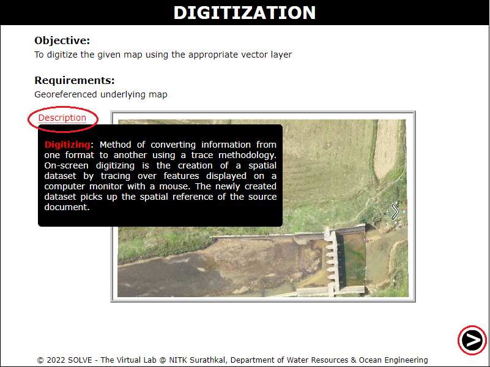
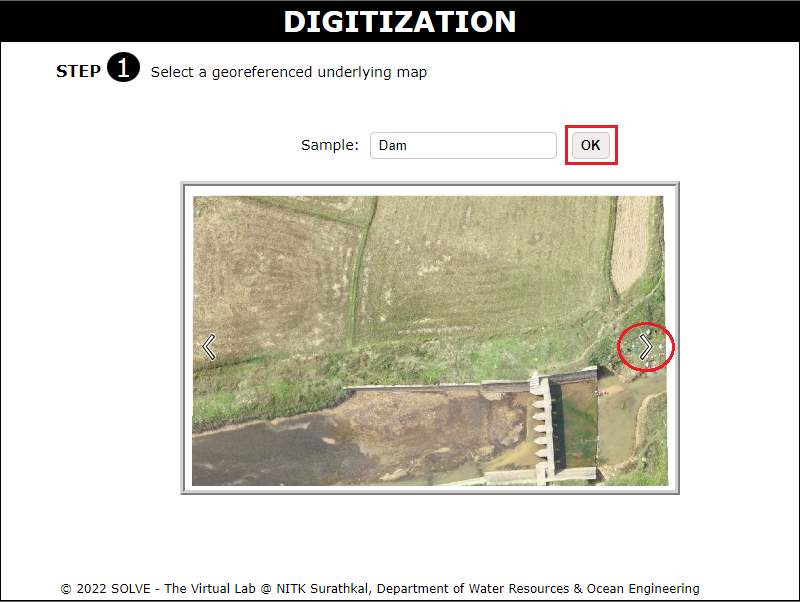
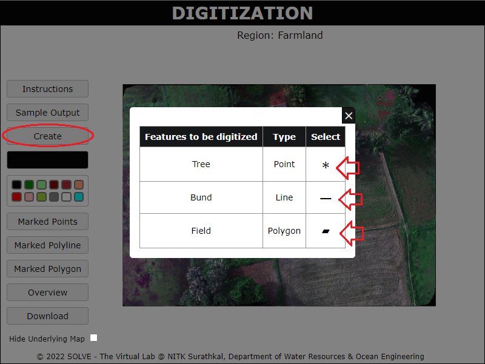
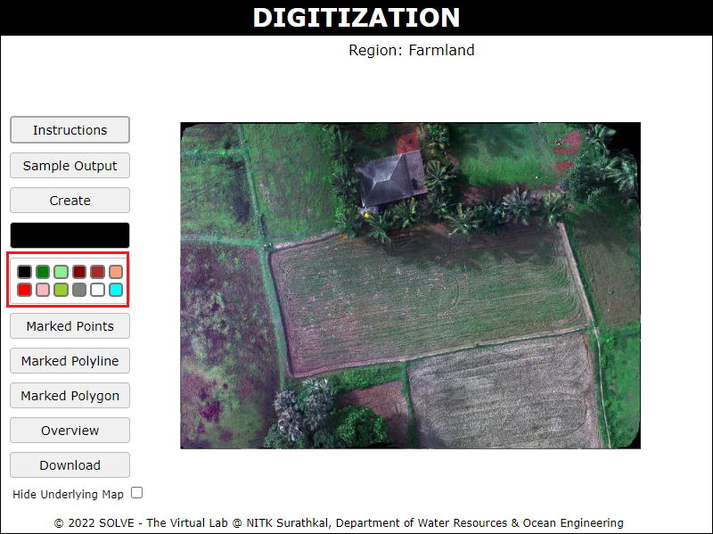
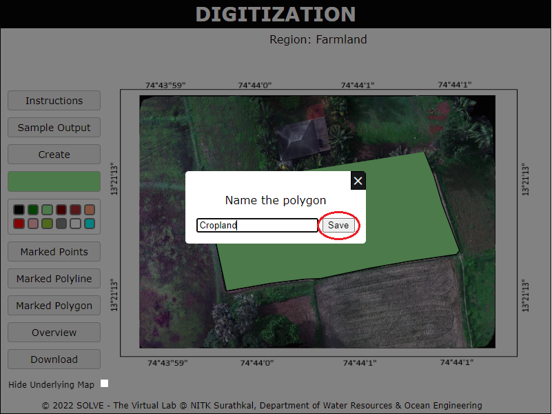
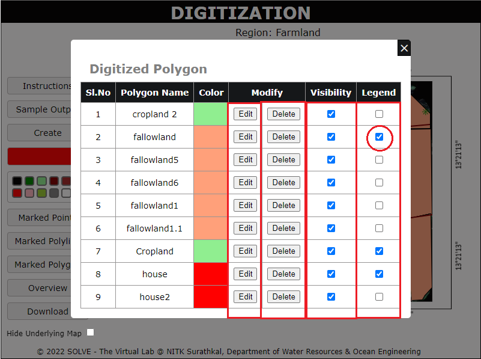
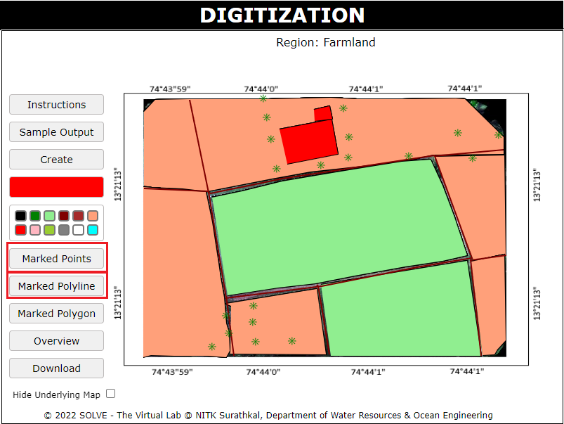
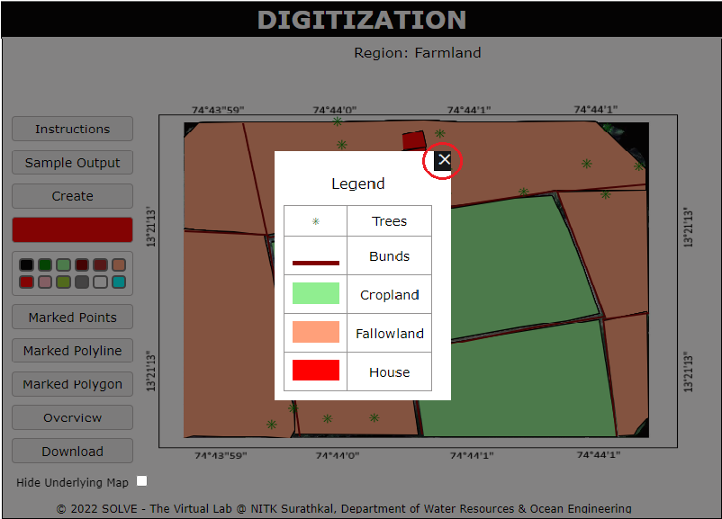
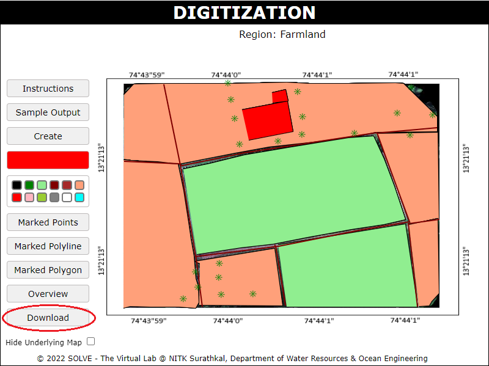

### Procedure

1. When you click on the Digitization simulation file, a new window will open as shown below. Hover on Description and click Next.  
   

2. Click on the slideshow to select the underlying map and click on OK and click on Next.
   

3. Click on Instructions and read the instructions given.
   

4. Click on Sample output to see a digitized map of the selected underlying map.
   

5. Click on Create and select the type of feature from the table.
   

6. Select the appropriate color for the Polygon, Polyline, and Point features to be created.
   

7. Draw the feature on the canvas and press Enter to save and name the feature.
   

8. Click on Marked Polygon to see the features created on the canvas.
   

9. View the list of polygon features created in the table shown, click on Edit to Rename the feature or change the colour. Click on delete to remove the feature. Untick the visibility to remove the visibility of the feature. To retain the feature in Legend of the final map, tick the feature in the Legend section.
   

10. Click on Marked Point and Marked Polyline to view the line and point feature.  
    

11. Click on Overview to see the features identified on the map.  
    

12. Click on Download to download the digitized map created.  
    
